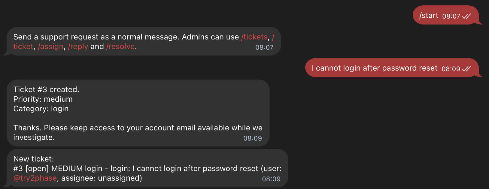
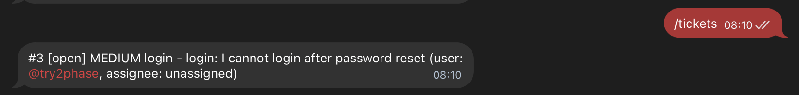
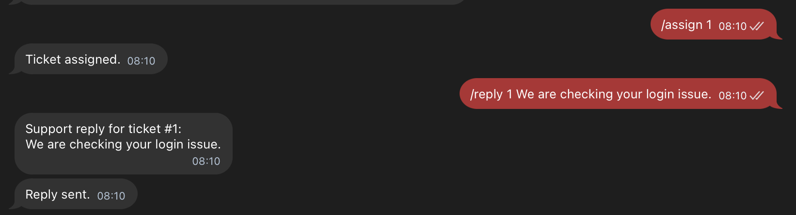
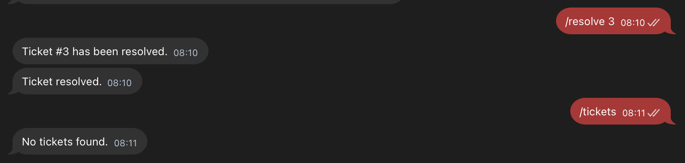

# MA_01_MiniCRM

[](https://github.com/cbrt3ltrpv/MA_01_MiniCRM/actions/workflows/ci.yml)


Telegram support desk bot with rule-based multi-agent triage, SQLite storage, admin commands, Docker setup, and tests.

## Positioning

MA_01_MiniCRM is not a production LLM product. The current implementation uses a deterministic, rule-based multi-agent pipeline, so it can run locally without paid AI APIs and can be tested reliably.

The code is organized around an AI-ready support workflow: task decomposition, ticket lifecycle, routing, persistence, Telegram admin operations, Dockerized deployment, and extension points for future OpenAI, Anthropic, or RAG integration.

## Project Scope

This repository includes:

- end-to-end Telegram bot development
- multi-agent task decomposition
- support ticket lifecycle design
- rule-based AI-ready triage logic
- SQLite persistence layer
- admin command interface
- Dockerized local deployment
- automated tests and GitHub Actions CI
- clean project structure for further LLM/RAG integration

## Why This Project Matters

Support teams often receive repetitive requests that need initial classification, prioritization, and routing before a human operator can respond. This project shows how a Telegram-based support intake can be structured as an AI-ready workflow with ticket storage, admin operations, triage trace, and a clear extension path toward LLM/RAG-based automation.

## What It Does

MA_01_MiniCRM turns a Telegram bot into a small support desk. A user sends a normal message, the system creates a ticket, runs rule-based multi-agent triage, suggests a first reply, stores the ticket in SQLite, and lets an admin manage the ticket from Telegram commands.

## Architecture

```text
User message
    -> Telegram Bot
    -> Ticket Service
    -> Triage Pipeline
    -> SQLite Storage
    -> Admin Commands
```

Main components:

- Telegram interface - receives user requests and admin commands
- Ticket service - creates and updates support tickets
- Triage pipeline - classifies requests, assigns priority, detects sentiment, adds tags, and drafts replies
- Storage layer - stores tickets and events in SQLite
- Admin interface - allows support/admin users to inspect, assign, reply to, and resolve tickets
- Tests/CI - validates core ticket lifecycle and triage behavior automatically

Detailed architecture notes: [docs/architecture.md](docs/architecture.md)

## Multi-Agent Flow

The project uses a deterministic multi-agent pipeline. Each agent owns one part of the support triage workflow:

- `CategoryAgent` detects the support area: billing, login, bug, delivery, feature request, or general.
- `PriorityAgent` decides ticket urgency: low, medium, high, or urgent.
- `SentimentAgent` estimates customer tone: positive, neutral, or negative.
- `TaggingAgent` creates searchable tags from the message.
- `ReplyDraftAgent` drafts the first support response.
- `SupervisorAgent` reviews the previous decisions and produces overall confidence.

The final ticket timeline stores the agent trace, so `/ticket <id>` shows how the system reached its decision.

## Features

- Telegram support intake for customer messages
- Admin commands for listing, viewing, assigning, replying, and resolving tickets
- Rule-based multi-agent triage with decision trace
- SQLite persistence
- CLI demo without Telegram credentials
- Docker and Docker Compose setup
- GitHub Actions CI
- Unit tests for triage and ticket lifecycle

## Quick Start

Clone the repository:

```bash
git clone https://github.com/cbrt3ltrpv/MA_01_MiniCRM.git
cd MA_01_MiniCRM
```

Create local configuration:

```bash
cp .env.example .env
```

Edit `.env` and set your Telegram bot token and admin IDs:

```env
TELEGRAM_BOT_TOKEN=your_bot_token
SUPPORT_ADMIN_IDS=123456789
SUPPORT_DB_PATH=supportdesk.db
```

Install dependencies:

```bash
python3 -m pip install -e ".[telegram]"
```

Run tests:

```bash
python3 -m unittest discover -s tests
```

Run the CLI demo without Telegram:

```bash
python3 -m supportdesk_ai.demo
```

Check Telegram bot credentials:

```bash
python3 -m supportdesk_ai.check_bot
```

Run the Telegram bot:

```bash
python3 -m supportdesk_ai.telegram_bot
```

## Docker

Run with Docker Compose:

```bash
docker compose up --build
```

## Telegram Commands

User commands:

```text
/start
/mytickets
/whoami
```

Admin commands:

```text
/tickets
/ticket 1
/assign 1
/reply 1 We are checking your issue.
/resolve 1
```

## Screenshots / Diagrams

- Architecture diagram: [docs/architecture.md](docs/architecture.md)
- Telegram ticket creation flow
- Admin command example
- Ticket resolution flow
- Test/CI status badge

### Ticket Created



### Ticket List



### Admin Reply



### Ticket Resolved



## Example Ticket Trace

```text
Multi-agent triage: category=login, priority=medium, sentiment=negative, confidence=0.72.
Trace: category-agent -> login; priority-agent -> medium; sentiment-agent -> negative; tagging-agent -> login, medium, password; reply-draft-agent -> drafted_reply; supervisor-agent -> overall_confidence=0.72
```

## Future Improvements

- Add OpenAI / Anthropic provider integration
- Add RAG over support knowledge base
- Add PostgreSQL support for production deployment
- Add operator web dashboard
- Add role-based admin permissions
- Add analytics for ticket categories and response time
- Add structured logs and monitoring
- Add message history and conversation context
- Add escalation flow from automated triage to human operator

## Security Notes

Do not commit `.env`, Telegram tokens, API keys, webhook URLs, local databases, or real user data. Use `.env.example` for placeholder configuration only.

The repository is intended to contain only safe sample configuration, source code, tests, Docker files, docs, and screenshots.

## Tech Stack

- Python 3.9+
- aiogram 3
- SQLite
- Docker / Docker Compose
- GitHub Actions
- unittest
