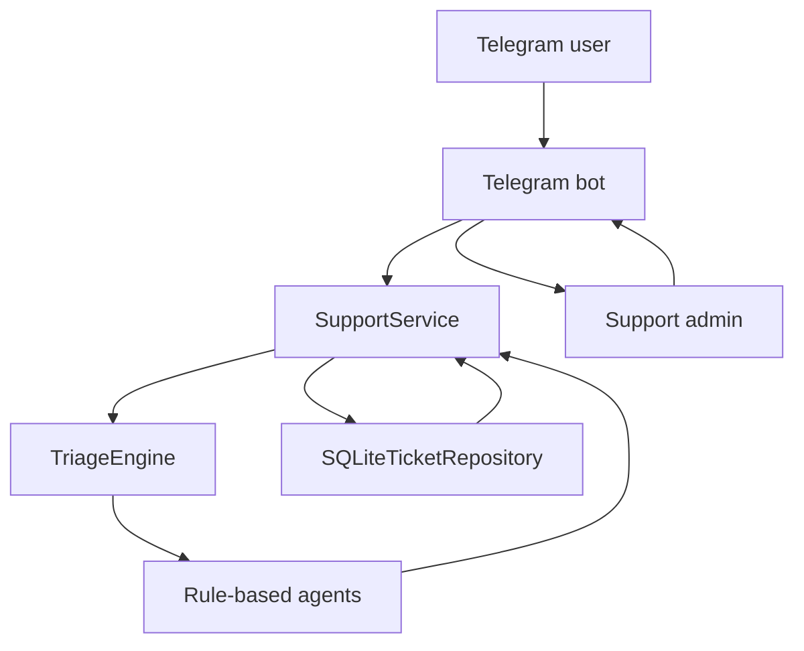

# MA_01_MiniCRM

[](https://github.com/cbrt3ltrpv/MA_01_MiniCRM/actions/workflows/ci.yml)


MA_01_MiniCRM is a Telegram support desk bot that turns incoming chat messages into tracked support tickets with deterministic multi-agent triage.

The project is intentionally LLM-ready but does not require paid model APIs today. Its current pipeline
uses rule-based agents for category detection, priority scoring, sentiment, tags, reply drafting, and
supervisor confidence. This keeps the workflow inspectable, reproducible, and easy to test locally.

## Repository Snapshot

| Area | Status |
| --- | --- |
| Runtime | Telegram long-polling bot with aiogram 3 |
| Triage | Deterministic rule-based multi-agent pipeline |
| Storage | Local SQLite ticket and event repository |
| Interfaces | Telegram commands and local CLI demo |
| Delivery | Editable Python package, Dockerfile, Docker Compose |
| Quality gate | unittest suite and GitHub Actions CI |

## Contents

- [Preview](#preview)
- [What It Does](#what-it-does)
- [Workflow](#workflow)
- [Agents](#agents)
- [Quick Start](#quick-start)
- [Configuration](#configuration)
- [Running Telegram](#running-telegram)
- [Docker Runtime](#docker-runtime)
- [Development](#development)
- [Project Structure](#project-structure)
- [Extension Points](#extension-points)
- [Limitations](#limitations)

## Preview

### Ticket Created


### Ticket List


### Admin Reply


### Ticket Resolved


## What It Does

- Accepts support requests from Telegram users as normal messages.
- Creates SQLite-backed tickets with status, category, priority, sentiment, tags, and suggested reply.
- Runs a deterministic multi-agent triage pipeline and stores the decision trace in the ticket timeline.
- Gives admins Telegram commands to list, inspect, assign, reply to, and resolve tickets.
- Includes a CLI demo, Docker Compose runtime, unit tests, and GitHub Actions CI.
- Keeps the current implementation local-first: no hosted service, external model account, or paid API key is required to run the demo and tests.

## Workflow



The deeper component map is documented in [docs/architecture.md](docs/architecture.md).

## Agents

| Agent | Responsibility | Input | Output | Review path |
| --- | --- | --- | --- | --- |
| `CategoryAgent` | Detects the support area | Normalized message text | `billing`, `login`, `bug`, `delivery`, `feature_request`, or `general` | Stored in the triage trace |
| `PriorityAgent` | Scores urgency | Message text and category | `low`, `medium`, `high`, or `urgent` | Admin sees priority on ticket views |
| `SentimentAgent` | Estimates customer tone | Message text | `positive`, `neutral`, or `negative` | Admin reviews before replying |
| `TaggingAgent` | Builds searchable tags | Category, priority, keyword hits | Sorted tag list | Stored with the ticket |
| `ReplyDraftAgent` | Suggests first support response | Category and priority | Draft acknowledgement | Human admin owns final reply |
| `SupervisorAgent` | Aggregates confidence | Previous agent decisions | `overall_confidence` score | Trace is visible through `/ticket <id>` |

All agents are implemented in [supportdesk_ai/agents.py](supportdesk_ai/agents.py). The orchestration entry point is [supportdesk_ai/triage.py](supportdesk_ai/triage.py).

## Components

| Component | Role | Behavior |
| --- | --- | --- |
| `supportdesk_ai.telegram_bot` | aiogram bot entry point and command router | Runtime integration with Telegram |
| `supportdesk_ai.service` | Ticket lifecycle service | Deterministic application logic |
| `supportdesk_ai.repository` | SQLite persistence for tickets and events | Local database storage |
| `supportdesk_ai.formatting` | Telegram response formatting | Deterministic presentation layer |
| `supportdesk_ai.demo` | Local non-Telegram demo | Creates example tickets in a temp SQLite database |
| `tests/` | Unit tests for triage and lifecycle behavior | Run in local development and CI |

## Use Cases

- Demonstrating a compact CRM-style support workflow inside Telegram.
- Testing deterministic agent orchestration before introducing LLM providers.
- Prototyping support ticket lifecycles with auditable event history.
- Running a local support bot with simple SQLite persistence and admin commands.

## Quick Start

Clone the repository and create local configuration:

```bash
git clone https://github.com/cbrt3ltrpv/MA_01_MiniCRM.git
cd MA_01_MiniCRM
cp .env.example .env
```

Install the package with Telegram dependencies:

```bash
python3 -m pip install -e ".[telegram]"
```

Run the test suite:

```bash
python3 -m unittest discover -s tests
```

Run the CLI demo without Telegram credentials:

```bash
python3 -m supportdesk_ai.demo
```

You can also use the installed console script:

```bash
supportdesk-demo
```

## Configuration

Copy `.env.example` to `.env` and set the values for your bot:

```env
TELEGRAM_BOT_TOKEN=your_bot_token
SUPPORT_ADMIN_IDS=123456789
SUPPORT_DB_PATH=supportdesk.db
```

| Variable | Required | Purpose |
| --- | --- | --- |
| `TELEGRAM_BOT_TOKEN` | Yes | Bot token from BotFather |
| `SUPPORT_ADMIN_IDS` | Yes for admin workflow | Comma-separated Telegram user IDs allowed to use admin commands |
| `SUPPORT_DB_PATH` | No | SQLite database path, defaults to `supportdesk.db` |

Use `/whoami` in the bot to see the current Telegram user ID before filling `SUPPORT_ADMIN_IDS`.

## Running Telegram

Check that credentials are present:

```bash
python3 -m supportdesk_ai.check_bot
```

Start the Telegram bot:

```bash
python3 -m supportdesk_ai.telegram_bot
```

Available user commands:

```text
/start
/mytickets
/whoami
```

Available admin commands:

```text
/tickets
/ticket 1
/assign 1
/reply 1 We are checking your issue.
/resolve 1
```

The bot uses long polling. For local development, a public webhook URL is not required.

## Docker Runtime

Docker Compose builds the app image, reads `.env`, and stores the SQLite database under `./data`:

```bash
docker compose up --build
```

The Compose file sets `SUPPORT_DB_PATH=/app/data/supportdesk.db` inside the container.

## Example Triage Trace

```text
Multi-agent triage: category=billing, priority=urgent, sentiment=negative, confidence=0.82.
Trace:
category-agent -> billing
priority-agent -> urgent
sentiment-agent -> negative
tagging-agent -> billing, card, charge, contains_id, payment, urgent
reply-draft-agent -> drafted_reply
supervisor-agent -> overall_confidence=0.82
```

The trace is attached to the ticket event timeline, so an admin can inspect how a decision was produced instead of seeing only the final label.

## Development

| Task | Command |
| --- | --- |
| Install editable package | `python3 -m pip install -e ".[telegram]"` |
| Run tests | `python3 -m unittest discover -s tests` |
| Run CLI demo | `python3 -m supportdesk_ai.demo` |
| Check bot config | `python3 -m supportdesk_ai.check_bot` |
| Start bot | `python3 -m supportdesk_ai.telegram_bot` |
| Run with Docker Compose | `docker compose up --build` |

CI runs the unittest suite on Python 3.11 through `.github/workflows/ci.yml`.

## Project Structure

```text
MA_01_MiniCRM/
|-- supportdesk_ai/
|   |-- agents.py          # deterministic specialist agents
|   |-- triage.py          # agent orchestration
|   |-- service.py         # ticket lifecycle service
|   |-- repository.py      # SQLite persistence
|   |-- telegram_bot.py    # aiogram command handlers
|   `-- demo.py            # local CLI demo
|-- tests/
|   `-- test_service.py    # triage and lifecycle tests
|-- docs/
|   `-- architecture.md    # component and flow notes
|-- screenshots/           # Telegram workflow screenshots
|-- Dockerfile
|-- docker-compose.yml
`-- pyproject.toml
```

## Extension Points

- Replace `CategoryAgent`, `PriorityAgent`, or `ReplyDraftAgent` with OpenAI, Anthropic, or another provider while keeping the service and Telegram layers stable.
- Add retrieval over a support knowledge base before reply drafting.
- Store conversation history and retrieved source references in ticket events.
- Add escalation rules when confidence is low, sentiment is negative, or priority is urgent.
- Move from SQLite to PostgreSQL for a shared multi-operator deployment.

## Limitations

- Current triage is deterministic keyword logic, not an LLM-backed classifier.
- Admin access is based on Telegram user IDs from configuration.
- SQLite is suitable for local demos and small deployments, not a multi-instance production setup.
- There is no web dashboard, analytics layer, or role-based permission model yet.
- The repository does not include a license file.

## Roadmap

- Add provider adapters for LLM-based classification and reply drafting.
- Add RAG over support documentation.
- Introduce PostgreSQL storage for production-style deployment.
- Add structured logs, metrics, and ticket analytics.
- Build an operator web dashboard for multi-admin workflows.
- Add conversation context and escalation policies.

## Security Notes

Do not commit `.env`, Telegram tokens, API keys, webhook URLs, local databases, or real user data. Keep secrets in local environment files or deployment secret storage.

The repository is intended to contain only safe sample configuration, source code, tests, Docker files, docs, and screenshots.

## Tech Stack

- Python 3.9+
- aiogram 3
- SQLite
- Docker and Docker Compose
- GitHub Actions
- unittest

## GitHub Metadata

Recommended repository metadata:

- Description: `Telegram support desk bot with deterministic multi-agent triage, SQLite tickets, Docker runtime, and CI.`
- Topics: `telegram-bot`, `support-desk`, `crm`, `python`, `aiogram`, `sqlite`, `docker`, `multi-agent`, `llm-ready`
- Homepage: leave empty until a real demo, docs site, or deployment URL exists.

## License

No license has been selected for this repository yet. Add a `LICENSE` file before inviting external reuse or contribution.
