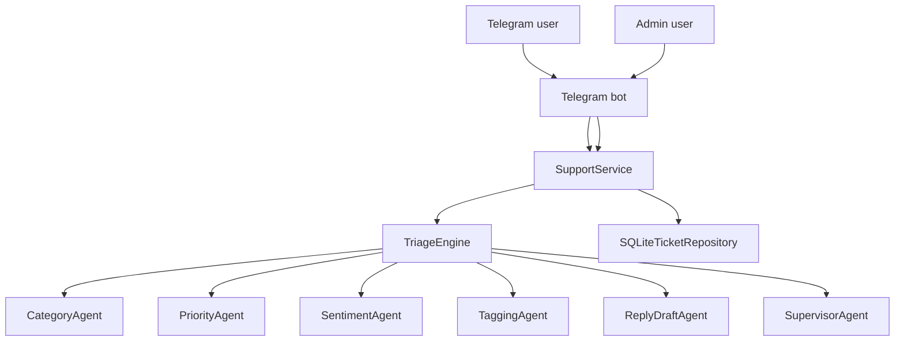

# Architecture

MA_01_MiniCRM is a Telegram support desk bot with an LLM-ready architecture. The current implementation uses deterministic rule-based agents, which makes the workflow easy to run locally, inspect, and test. The same module boundaries can later be connected to LLM providers or a RAG knowledge base.

## Request Flow



## Components

- `supportdesk_ai.telegram_bot` - Telegram entry point based on aiogram. It receives user messages, handles commands, and routes actions to the service layer.
- `supportdesk_ai.service` - application service layer. It owns ticket creation, assignment, replies, resolution, and user ticket lookup.
- `supportdesk_ai.triage` - orchestrates the agent pipeline and returns a single triage result.
- `supportdesk_ai.agents` - deterministic specialist agents for category, priority, sentiment, tags, reply draft, and supervision.
- `supportdesk_ai.repository` - SQLite persistence for tickets and timeline events.
- `tests/` - automated checks for ticket lifecycle and service behavior.

## Agent Responsibilities

| Agent | Responsibility | Current implementation |
| --- | --- | --- |
| `CategoryAgent` | Detect support topic | Keyword rules |
| `PriorityAgent` | Decide urgency | Keyword and category rules |
| `SentimentAgent` | Estimate customer tone | Positive/negative term counts |
| `TaggingAgent` | Produce searchable tags | Category, priority, matched keywords |
| `ReplyDraftAgent` | Suggest first reply | Template selection |
| `SupervisorAgent` | Summarize confidence | Aggregated decision scores |

## Ticket Lifecycle

```text
open -> assigned -> waiting -> resolved
              \-> closed by user
```

Each important action is recorded as a ticket event, including the multi-agent triage trace. This makes the bot behavior inspectable from `/ticket <id>`.

## LLM/RAG Extension Points

The project is structured so LLM features can be added without rewriting the Telegram bot or storage layer:

- Replace or extend `CategoryAgent`, `PriorityAgent`, and `ReplyDraftAgent` with OpenAI or Anthropic provider calls.
- Add a knowledge-base retrieval layer before `ReplyDraftAgent`.
- Store conversation context and retrieved sources in ticket events.
- Add escalation rules when model confidence is low or sentiment is negative.
